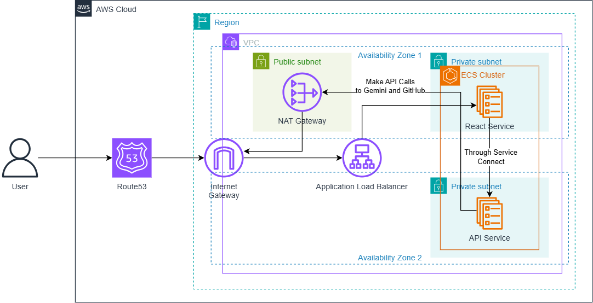
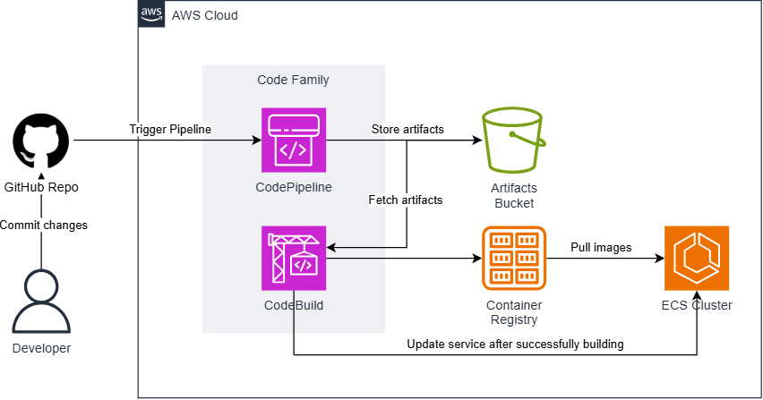

# LeetCode AI Explainer

LeetCode AI Explainer is a web application that provides AI-generated explanations for LeetCode problem solutions. The system retrieves problem solutions from a GitHub repository, generates detailed explanations using the Gemini AI model, and displays them in an easy-to-understand format.

#### Cloud diagram:



1. User accesses the application via a domain managed by Amazon Route 53.
2. The request routes through an Internet Gateway and reaches the Application Load Balancer (ALB).
3. The ALB directs traffic to the React frontend service running on an ECS cluster in private subnets (1 per AZ).
4. The React service makes internal calls to the API service, using Service Connect for communication.
5. The ECS cluster accesses external services like Gemini and GitHub through a NAT Gateway in a public subnet.

#### CI/CD Workflow with CodeFamily:



1. Developer pushes code changes to a GitHub repository.
2. This triggers AWS CodePipeline, which orchestrates the workflow.
3. CodePipeline stores and retrieves build artifacts from an S3 artifacts bucket.
4. AWS CodeBuild builds the application, creates a Docker image, and pushes it to the Container Registry.
5. Once the image is available, CodeBuild run `update-service` command to make ECS Cluster pulls new image and updates the service automatically.

## Features

- Fetch LeetCode problem solutions by ID
- Generate detailed AI explanations with the Gemini 2.0 model
- Responsive web interface built with React and Tailwind CSS
- Comprehensive solution breakdowns including:
  - Problem description
  - Intuition behind the solution
  - Step-by-step algorithm walkthrough
  - Time and space complexity analysis
  - Code explanations with syntax highlighting

## Project Structure

The project consists of two main components:

### Backend (Go API)

- Built with Go 1.24
- Uses Chi router for HTTP routing
- Integrates with Google's Gemini AI for generating explanations
- DynamoDB for problem data storage
- AWS infrastructure for deployment

### Frontend (React)

- Built with React 19
- Styled with Tailwind CSS
- Responsive design for all device sizes
- Clean UI with loading states and error handling
- More details in the [frontend README](web/README.md)

## Getting Started

### Prerequisites

- Go 1.24+
- Node.js 22+
- Docker (for containerized deployment)
- AWS account (for production deployment)

### Local Development

1. Clone the repository:
   ```bash
   git clone https://github.com/weebNeedWeed/leetcode-ai-explainer.git
   cd leetcode-ai-explainer
   ```

2. Create an [`.env`](.env) file with the following variables:
   ```
   GITHUB_TOKEN=your_github_token
   DDB_TABLE_NAME=your_dynamodb_table
   GEMINI_APIKEY=your_gemini_api_key
   ```

3. Build Docker images:
   ```bash
   make build-api
   make build-react
   ```

4. Run with Docker Compose:
   ```bash
   docker-compose up
   ```

5. The application will be available at:
   - Frontend: http://localhost:8080
   - Backend API: http://localhost:9090

## Deployment

The project includes Terraform configurations for deploying to AWS with:
- ECS for containerized services
- ALB for load balancing
- ECR for container registry
- Route53 for DNS management
- AWS CodePipeline for CI/CD

### Terraform Deployment

1. Initialize backend state storage:
   ```bash
   cd terraform/environments/aws-backend
   terraform init
   terraform apply
   ```

2. Deploy the application:
   ```bash
   cd terraform/environments/production
   terraform init
   terraform apply -var="github_token=YOUR_TOKEN" -var="gemini_apikey=YOUR_KEY"
   ```

## Project Architecture

The application uses a monolith architecture with:
- React frontend served via Nginx
- Go API backend
- DynamoDB for data persistence
- AWS services for infrastructure

## License

This project is open-sourced under the MIT License.

## Contributing

Contributions are welcome! Please feel free to submit a Pull Request.